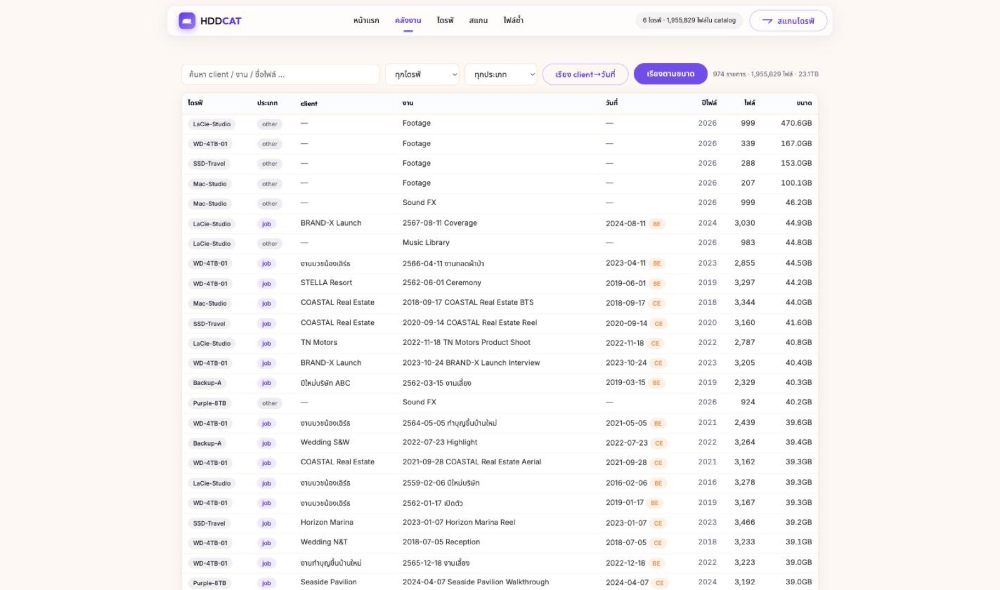

# HDDCAT 🐈💾

**Every file you own. One search away.** — Catalog every external drive you have into one searchable index. Find any file in under a second, without plugging a single drive in.

[Website](https://hddcat.tnmlab.dev) · [How to use (ไทย)](https://hddcat.tnmlab.dev/how-to.html) · MIT License · macOS



## Why

Photographers and video editors end up with a mountain of external HDDs — and no idea which drive holds which file. HDDCAT scans each drive once into a local SQLite catalog, then answers instantly: which drive, which folder. It also groups a decade of client work by name/date (understands both CE and Thai Buddhist-era dates) and finds duplicate files across drives.

## Features

- Scan any mounted drive into a local catalog (100k files ≈ seconds)
- Search everything while drives sit on a shelf
- Smart library: auto-groups client / job / date (CE + BE calendars)
- Cross-drive duplicate finder (name+size, read-only)
- Reclaim space: editor cache/junk detection, big-and-untouched files, where the space went — exports a checklist, never deletes
- Move plan: which old job folders to move off a near-full drive and which drive can take them (understands that several labels can be one physical disk)
- Plug-in detection: pops "scan now?" when a drive mounts
- **Ask it from your AI assistant**: `catalog.py mcp` is an MCP server (stdio, stdlib only) exposing 10 read-only tools — drives and free space, projects by size, archive candidates, reclaimable cache, cross-drive duplicates, and the move plan. A catalog is more useful asked than exported: "which drive is tightest?" → "what's old on it?" → "where should it go?"
- Go to folder: once a drive is plugged in, jump from any row — library, search hits, or the reclaim-space lists — straight to the real folder in Finder (greyed out while the drive is away)
- Self-updating .app, native window, zero telemetry (one version-check ping, can be disabled)

## The whole app is ONE file

`catalog.py` — Python stdlib only. No pip installs, no node_modules, no build step. The UI is vanilla HTML/CSS/JS embedded in the same file. This is a feature, not an accident (see Contributing).

The one exception is `shell/HDDCATShell.swift` (~350 lines, AppKit + WebKit): the native macOS window that `HDDCAT.app` opens, so the UI renders in its own window with its own Dock icon instead of a browser tab. It only starts `catalog.py serve --no-browser` and points a WKWebView at it — no app logic lives there. `build-dist` compiles it when Xcode Command Line Tools are present and falls back to the old browser launcher when they aren't, so `catalog.py` alone still is the whole program.

## Run from source

```
git clone https://github.com/korakotcha06-dev/hddcat.git
cd hddcat
python3 catalog.py serve
```

(macOS ships python3 with the Command Line Tools. Data lives in `catalog.db` next to where you run it — use `--db path` to point elsewhere.)

## CLI

| command | does |
|---|---|
| `scan /Volumes/X --label X` | index a drive |
| `search <keyword>` | find files across all drives |
| `report` | per-drive summary |
| `dedup` | duplicate candidates across drives |
| `reclaim [--junk\|--big-old\|--by-type]` | what can be deleted/moved to free space (read-only) |
| `reclaim --move-plan` | which folders to move off the near-full drives, and where to |
| `reclaim --consolidate` | same job sitting on several drives: a real copy, or split in two |
| `groups --by-client` | cluster jobs by client name |
| `export-folders-csv out.csv --smart-depth` | folder rollup for Excel |
| `export-obsidian <vault>` | one Markdown note per drive |
| `forget <label> --yes` | remove a drive from the catalog |
| `open <label> [relpath]` | open the real folder in Finder, if that drive is plugged in |
| `mcp` | MCP server (stdio) — let an AI assistant query the catalog directly |
| `serve` | local web UI |
| `build-dist` | build the distributable zip (.app) |

## Contributing

PRs and forks welcome — especially:

- **Windows / Linux port** (drive detection + paths are the main work)
- Content-hash dedup (opt-in, for mounted drives)
- UI translations (EN)
- Homebrew tap

Read [CONTRIBUTING.md](CONTRIBUTING.md) first — the zero-dependency rule is load-bearing.

## Supporters ☕

People who keep the cat awake. [Buy me a coffee](https://www.buymeacoffee.com/korakot) and your name + avatar goes up on the [website](https://hddcat.tnmlab.dev/#sponsors) and here.

*No supporters yet — be the first!*

(When sponsors exist later, this section gets avatar images — manual per-sponsor updates.)

## เวอร์ชันภาษาไทย

ดาวน์โหลดตัวใช้งาน + วิธีใช้ทั้งหมดที่ [hddcat.tnmlab.dev](https://hddcat.tnmlab.dev)

---
Made with a sleeping cat by [Touchnewmedia Co., Ltd.](https://www.thetnm.com) · [Buy me a coffee](https://www.buymeacoffee.com/korakot)
